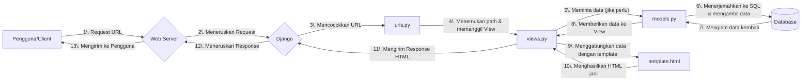

# Proyek Aplikasi Django - Majulah Shop

Repositori ini berisi sebuah aplikasi Football Shop sederhana menggunakan Django yang dibuat untuk memenuhi tugas individu mata kuliah Pemrograman Berbasis Platform.

Repo: https://github.com/Khawarizmi14/majulah-shop

Web: https://khawarizmi-aydin-majulahshop.pbp.cs.ui.ac.id

## Implementasi

### 1. Inisialisasi Proyek

Proyek dibuat dengan `django-admin startproject majulah_shop .` (tanda `.`mencegah Django membuat direktori tambahan yang tidak perlu) dan aplikasi dibuat dengan `python manage.py startapp main`. Aplikasi `main` ini direncanakan sebagai pusat dari fitur utama website.

### 2. Setup Environment

Mulai dengan membuat _virtual environment_ menggunakan `python -m venv env`. Tujuannya adalah untuk mengisolasi semua library dan framework (dependensi) yang spesifik untuk proyek ini, sehingga tidak akan ada konflik versi dengan proyek Python lain di komputer lokal. Proyek disiapkan dengan memisahkan variabel konfigurasi ke dalam file `.env` dan `.env.prod`, mendaftarkan semua dependensi dalam `requirements.txt`, serta memastikan repositori tetap bersih dengan menggunakan `.gitignore`.

### 3. Desain Model Data (`models.py`)

Model `Product` dibuat dalam `main/models.py` dengan tipe data yang sesuai untuk setiap atributnya, seperti `CharField` untuk nama, `IntegerField` untuk harga, dan `TextField` untuk deskripsi. Setelah model didefinisikan, saya membuat file migrasi dengan `makemigrations` untuk mencatat perubahan skema, lalu menerapkannya ke database menggunakan `migrate`.

### 4. Logika dan Tampilan (`views.py` & `template.html`)

View bernama `show_main` dibuat di `main/views.py` untuk halaman utama. Melalui view ini, data dinamis seperti nama dan kelas diteruskan ke dalam template `main.html` menggunakan sebuah context dictionary. Di dalam template, data tersebut ditampilkan dengan placeholder `{{ nama_variabel }}`.

### 5. Pengaturan Rute (`urls.py`)

Agar fungsi `show_main` dapat diakses, _routing_ URL diatur dalam dua tingkat untuk menjaga kerapian. Di level aplikasi (main/urls.py), path kosong dipetakan ke view `show_main`. Selanjutnya, di level proyek (`majulah_shop/urls.py`), semua lalu lintas dari URL utama situs didelegasikan ke `main/urls.py` menggunakan `include()`, sehingga menciptakan struktur yang modular.

### 6. Deployment ke PWS

Untuk memulai deployment, langkah pertama adalah membuat proyek baru di PWS dan menyesuaikan _environment variables_ dengan file `.env.prod`. Setelah itu, lanjutkan dengan konfigurasi produksi di dalam file `settings.py` dengan cara mengubah `ALLOWED_HOSTS` untuk mengizinkan akses dari domain PWS. Sebagai tahap akhir, hubungkan remote Git ke PWS untuk mengelola repositori.

```git
git remote add pws https://khawarizmi-aydin-majulahshop.pbp.cs.ui.ac.id/
git branch -M master
git push pws master
```

## Bagan



### Penjelasan Keterkaitan Antar Komponen

- `urls.py` (Router)

  - Mencocokkan URL dari request dengan path yang terdaftar.
  - Meneruskan request ke fungsi views.py yang sesuai.

- `views.py` (Logic)

  - Pusat logika bisnis dan pemrosesan.
  - Berinteraksi dengan models.py untuk operasi data (Create, Read, Update, Delete).
  - Mengirimkan data ke template.html untuk ditampilkan.
  - Menghasilkan HTTP Response untuk dikirim kembali ke client.

- `models.py` (Data Schema)

  - Mendefinisikan struktur database menggunakan kelas Python.
  - Menjadi perantara antara views.py dengan database.

- `template.html` (Presentation)

  - Kerangka tampilan (UI) yang akan dilihat pengguna.
  - Menerima dan menampilkan data yang dikirim dari views.py.

## Peran `settings.py`

Sebagai pusat kendali proyek Django, `settings.py` menyatukan semua konfigurasi krusial dalam satu lokasi. File ini mengatur detail koneksi database, mendaftarkan aplikasi yang digunakan, dan menetapkan parameter keamanan penting seperti secret key dan debug mode. Dengan adanya file terpusat ini, seluruh proyek menjadi lebih mudah untuk dikelola dan disesuaikan.

## Cara Kerja Migrasi Database di Django

Bertujuan untuk sinkronisasi antara model dan skema database. Terdapat dua tahap:

1. `python manage.py makemigrations`: mendeteksi perubahan pada `models.py` (penambahan field, model baru, dll) dan membuat file instruksi di dalam folder `migrations/`.

2. `python manage.py migrate`: membaca file instruksi yang belum dijalankan dari folder `migrations/` dan menerjemahkan instruksi tersebut menjadi perintah SQL dan mengeksekusinya ke database.

## Mengapa Django?

Django sangat cocok untuk pemula karena strukturnya yang rapi dan sudah menyediakan semua fitur dasar yang dibutuhkan. Konsep "**batteries-included**" membebaskan developer baru dari kerumitan membangun fitur umum seperti login (autentikasi) atau koneksi database (ORM), sehingga bisa langsung berkonsentrasi pada pembuatan fitur utama aplikasi.

## Feedback

Tutorial diberikan dengan sangat baik
