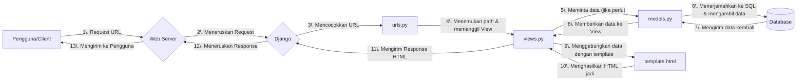

# Proyek Aplikasi Django - Majulah Shop

Repositori ini berisi sebuah aplikasi Football Shop sederhana menggunakan Django yang dibuat untuk memenuhi tugas individu mata kuliah Pemrograman Berbasis Platform.

Repo: https://github.com/Khawarizmi14/majulah-shop

Web: https://khawarizmi-aydin-majulahshop.pbp.cs.ui.ac.id

<details>
<summary>Tugas Individu 2</summary>

## Implementasi

### 1. Inisialisasi Proyek

Proyek dibuat dengan `django-admin startproject majulah_shop .` (tanda `.`mencegah Django membuat direktori tambahan yang tidak perlu) dan aplikasi dibuat dengan `python manage.py startapp main`. Aplikasi `main` ini direncanakan sebagai pusat dari fitur utama website.

### 2. Setup Environment

Mulai dengan membuat _virtual environment_ menggunakan `python -m venv env`. Tujuannya adalah untuk mengisolasi semua library dan framework (dependensi) yang spesifik untuk proyek ini, sehingga tidak akan ada konflik versi dengan proyek Python lain di komputer lokal. Proyek disiapkan dengan memisahkan variabel konfigurasi ke dalam file `.env` dan `.env.prod`, mendaftarkan semua dependensi dalam `requirements.txt`, serta memastikan repositori tetap bersih dengan menggunakan `.gitignore`.

### 3. Desain Model Data (`models.py`)

Model `Product` dibuat dalam `main/models.py` dengan tipe data yang sesuai untuk setiap atributnya, seperti `CharField` untuk nama, `IntegerField` untuk harga, dan `TextField` untuk deskripsi. Setelah model didefinisikan, saya membuat file migrasi dengan `makemigrations` untuk mencatat perubahan skema, lalu menerapkannya ke database menggunakan `migrate`.

### 4. Logika dan Tampilan (`views.py` & `template.html`)

View bernama `show_main` dibuat di `main/views.py` untuk halaman utama. Melalui view ini, data dinamis seperti nama dan kelas diteruskan ke dalam template `main.html` menggunakan sebuah context dictionary. Di dalam template, data tersebut ditampilkan dengan placeholder `{{ nama_variabel }}`.

### 5. Pengaturan Rute (`urls.py`)

Agar fungsi `show_main` dapat diakses, _routing_ URL diatur dalam dua tingkat untuk menjaga kerapian. Di level aplikasi (main/urls.py), path kosong dipetakan ke view `show_main`. Selanjutnya, di level proyek (`majulah_shop/urls.py`), semua lalu lintas dari URL utama situs didelegasikan ke `main/urls.py` menggunakan `include()`, sehingga menciptakan struktur yang modular.

### 6. Deployment ke PWS

Untuk memulai deployment, langkah pertama adalah membuat proyek baru di PWS dan menyesuaikan _environment variables_ dengan file `.env.prod`. Setelah itu, lanjutkan dengan konfigurasi produksi di dalam file `settings.py` dengan cara mengubah `ALLOWED_HOSTS` untuk mengizinkan akses dari domain PWS. Sebagai tahap akhir, hubungkan remote Git ke PWS untuk mengelola repositori.

```git
git remote add pws https://khawarizmi-aydin-majulahshop.pbp.cs.ui.ac.id/
git branch -M master
git push pws master
```

## Bagan



### Penjelasan Keterkaitan Antar Komponen

- `urls.py` (Router)

- Mencocokkan URL dari request dengan path yang terdaftar.
- Meneruskan request ke fungsi views.py yang sesuai.

- `views.py` (Logic)

- Pusat logika bisnis dan pemrosesan.
- Berinteraksi dengan models.py untuk operasi data (Create, Read, Update, Delete).
- Mengirimkan data ke template.html untuk ditampilkan.
- Menghasilkan HTTP Response untuk dikirim kembali ke client.

- `models.py` (Data Schema)

- Mendefinisikan struktur database menggunakan kelas Python.
- Menjadi perantara antara views.py dengan database.

- `template.html` (Presentation)

- Kerangka tampilan (UI) yang akan dilihat pengguna.
- Menerima dan menampilkan data yang dikirim dari views.py.

## Peran `settings.py`

Sebagai pusat kendali proyek Django, `settings.py` menyatukan semua konfigurasi krusial dalam satu lokasi. File ini mengatur detail koneksi database, mendaftarkan aplikasi yang digunakan, dan menetapkan parameter keamanan penting seperti secret key dan debug mode. Dengan adanya file terpusat ini, seluruh proyek menjadi lebih mudah untuk dikelola dan disesuaikan.

## Cara Kerja Migrasi Database di Django

Bertujuan untuk sinkronisasi antara model dan skema database. Terdapat dua tahap:

1. `python manage.py makemigrations`: mendeteksi perubahan pada `models.py` (penambahan field, model baru, dll) dan membuat file instruksi di dalam folder `migrations/`.

2. `python manage.py migrate`: membaca file instruksi yang belum dijalankan dari folder `migrations/` dan menerjemahkan instruksi tersebut menjadi perintah SQL dan mengeksekusinya ke database.

## Mengapa Django?

Django sangat cocok untuk pemula karena strukturnya yang rapi dan sudah menyediakan semua fitur dasar yang dibutuhkan. Konsep "**batteries-included**" membebaskan developer baru dari kerumitan membangun fitur umum seperti login (autentikasi) atau koneksi database (ORM), sehingga bisa langsung berkonsentrasi pada pembuatan fitur utama aplikasi.

## Feedback

Tutorial diberikan dengan sangat baik

</details>

<details>
<summary>Tugas Individu 3</summary>

## Mengapa Perlu Data Delivery?

Data delivery adalah proses fundamental pengiriman data antar sistem. Ini dibutuhkan karena platform modern memiliki arsitektur terdistribusi. Fungsinya:

- **Komunikasi Frontend-Backend**: Memungkinkan antarmuka pengguna (frontend) untuk meminta (`request`) dan menerima (`response`) data dari server (backend).
- **Integrasi API**: Menjadi jembatan komunikasi antara aplikasi Anda dengan layanan eksternal atau pihak ketiga (third-party services).
- **Arsitektur Microservices**: Memfasilitasi komunikasi antar layanan independen yang menyusun sebuah platform besar.

Tanpa data delivery, komponen-komponen platform tidak dapat bertukar informasi dan tidak akan berfungsi.

## XML vs JSON

**Untuk pengembangan web modern, JSON lebih unggul.**

1. **XML (eXtensible Markup Language)**: Menggunakan sintaksis berbasis tag (`<tag>data</tag>`). Strukturnya lebih detail (verbose) dan ukuran filenya lebih besar.
2. **JSON (JavaScript Object Notation)**: Menggunakan sintaksis berbasis pasangan kunci-nilai (`"key":"value"`). Strukturnya lebih ringkas dan ringan.

### Alasan JSON lebih populer:

- **Efisiensi**: JSON menghasilkan data yang lebih kecil ukurannya, sehingga transfer data lebih cepat dan proses parsing (analisis data) oleh mesin lebih ringan.
- **Kompatibilitas NATIVE dengan JavaScript**: JSON berasal dari JavaScript, data JSON dapat langsung diolah di lingkungan web tanpa perlu library atau proses konversi yang rumit.

## Fungsi `is_valid()` di Form Django

Method `is_valid()` adalah sebuah fungsi Boolean yang **menjalankan semua proses validasi** yang telah didefinisikan pada sebuah Form Django.

Fungsi utamanya:

1. **Validasi Data**: Memeriksa setiap data yang dikirim pengguna terhadap aturan yang ada di form (misalnya, `required`, `max_length`, `EmailField`).
2. **Pembersihan Data (Sanitization)**: Mengubah input menjadi tipe data Python yang benar dan aman.
3. **Periksa Error**: Jika ada data yang tidak valid, method ini akan mengisi atribut errors pada form dengan pesan kesalahan yang relevan.

Jika `is_valid()` mengembalikan `True`, maka data yang sudah divalidasi dan dibersihkan dapat diakses melalui kamus (`dictionary`) `form.cleaned_data.`

## Mengapa Perlu `csrf_token`?

`csrf_token` adalah sebuah mekanisme untuk **melindungi aplikasi dari serangan Cross-Site Request Forgery (CSRF)**.

### Apa yang terjadi jika tidak dipakai?

Seorang penyerang bisa memaksa browser pengguna yang sudah terautentikasi (login) untuk mengirimkan permintaan HTTP yang tidak diinginkan ke aplikasi Anda. Karena permintaan tersebut dikirim bersama cookie sesi yang valid, aplikasi Anda akan menganggapnya sebagai tindakan yang sah dari pengguna.

### Bagaimana `csrf_token` melindunginya?

1. Django menghasilkan sebuah **token rahasia yang unik** per sesi pengguna.
2. Token ini disisipkan sebagai input tersembunyi di dalam form (`<input type="hidden">`).
3. Saat form dikirim (via `POST`), Django akan membandingkan token dari form dengan token yang tersimpan di sisi server untuk sesi tersebut.
4. Jika token tidak cocok atau tidak ada, permintaan akan **ditolak**.

Penyerang tidak memiliki akses ke token rahasia ini, sehingga setiap upaya pemalsuan permintaan akan gagal.

## Implementasi

### 1. Format XML & JSON

Modifikasi `main/views.py` dan tambah fungsi `show_json`, `show_xml`, `show_json_by_id`, `show_xml_by_id`. Kode ini menggunakan serializer bawaan Django untuk mengubah QuerySet menjadi format JSON dan XML.

### 2. Routing URL

Modifikasi `main/urls.py` dan tambah routing untuk setiap fungsi view yang baru dibuat.

```
path('xml/', show_xml, name='show_xml'),
path('json/', show_json, name='show_json'),
path('xml/<str:product_id>/', show_xml_by_id, name='show_xml_by_id'),
path('json/<str:product_id>/', show_json_by_id, name='show_json_by_id'),
```

### 3. Redirect Halaman Form dan Halaman _Detail Product_

Buat file `base.html` di root folder yang selanjutnya akan digunakan untuk _template inheritance_. Kemudian, modifikasi `main.html` agar menggunakan template dari `base.html` tersebut. Halaman `main.html` ini akan menampilkan daftar semua produk yang ada, lengkap dengan tombol untuk mengarahkan ke halaman tambah produk (`add_product.html`) dan tautan individual pada setiap produk untuk menuju ke halaman detailnya (`product_detail.html`).

### 4. Buat Halaman Form

Buat file `forms.py` di `main` untuk mendefinisikan form produk dan file template `add_product.html` yang akan menggunakan form tersebut dengan placeholder `{{ form.as_table }}`.

### 5. Buat Halaman _Detail Product_

Buat file template `product_detail.html` untuk menampilkan semua detail dari satu objek produk yang dipilih. Halaman ini juga akan menyertakan tombol untuk kembali ke daftar produk utama.

## Postman

https://drive.google.com/drive/u/2/folders/1U_NDSyN_DfNs5Xm1y-IDQDTC6C_KTIlJ

## Feedback

Tutorial diberikan dengan sangat baik

</details>
