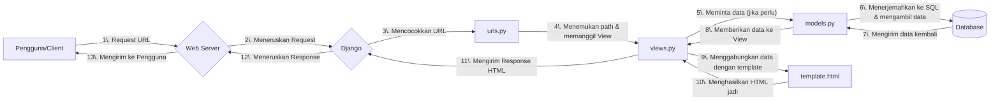

# Proyek Aplikasi Django - Majulah Shop

Repositori ini berisi sebuah aplikasi Football Shop sederhana menggunakan Django yang dibuat untuk memenuhi tugas individu mata kuliah Pemrograman Berbasis Platform.

Repo: https://github.com/Khawarizmi14/majulah-shop

Web: https://khawarizmi-aydin-majulahshop.pbp.cs.ui.ac.id

<details>
<summary>Tugas Individu 2</summary>

## Implementasi

### 1. Inisialisasi Proyek

Proyek dibuat dengan `django-admin startproject majulah_shop .` (tanda `.`mencegah Django membuat direktori tambahan yang tidak perlu) dan aplikasi dibuat dengan `python manage.py startapp main`. Aplikasi `main` ini direncanakan sebagai pusat dari fitur utama website.

### 2. Setup Environment

Mulai dengan membuat _virtual environment_ menggunakan `python -m venv env`. Tujuannya adalah untuk mengisolasi semua library dan framework (dependensi) yang spesifik untuk proyek ini, sehingga tidak akan ada konflik versi dengan proyek Python lain di komputer lokal. Proyek disiapkan dengan memisahkan variabel konfigurasi ke dalam file `.env` dan `.env.prod`, mendaftarkan semua dependensi dalam `requirements.txt`, serta memastikan repositori tetap bersih dengan menggunakan `.gitignore`.

### 3. Desain Model Data (`models.py`)

Model `Product` dibuat dalam `main/models.py` dengan tipe data yang sesuai untuk setiap atributnya, seperti `CharField` untuk nama, `IntegerField` untuk harga, dan `TextField` untuk deskripsi. Setelah model didefinisikan, buat file migrasi dengan `makemigrations` untuk mencatat perubahan skema, lalu menerapkannya ke database menggunakan `migrate`.

### 4. Logika dan Tampilan (`views.py` & `template.html`)

View bernama `show_main` dibuat di `main/views.py` untuk halaman utama. Melalui view ini, data dinamis seperti nama dan kelas diteruskan ke dalam template `main.html` menggunakan sebuah context dictionary. Di dalam template, data tersebut ditampilkan dengan placeholder `{{ nama_variabel }}`.

### 5. Pengaturan Rute (`urls.py`)

Agar fungsi `show_main` dapat diakses, _routing_ URL diatur dalam dua tingkat untuk menjaga kerapian. Di level aplikasi (main/urls.py), path kosong dipetakan ke view `show_main`. Selanjutnya, di level proyek (`majulah_shop/urls.py`), semua lalu lintas dari URL utama situs didelegasikan ke `main/urls.py` menggunakan `include()`, sehingga menciptakan struktur yang modular.

### 6. Deployment ke PWS

Untuk memulai deployment, langkah pertama adalah membuat proyek baru di PWS dan menyesuaikan _environment variables_ dengan file `.env.prod`. Setelah itu, lanjutkan dengan konfigurasi produksi di dalam file `settings.py` dengan cara mengubah `ALLOWED_HOSTS` untuk mengizinkan akses dari domain PWS. Sebagai tahap akhir, hubungkan remote Git ke PWS untuk mengelola repositori.

```git
git remote add pws https://khawarizmi-aydin-majulahshop.pbp.cs.ui.ac.id/
git branch -M master
git push pws master
```

## Bagan



### Penjelasan Keterkaitan Antar Komponen

- `urls.py` (Router)

- Mencocokkan URL dari request dengan path yang terdaftar.
- Meneruskan request ke fungsi views.py yang sesuai.

- `views.py` (Logic)

- Pusat logika bisnis dan pemrosesan.
- Berinteraksi dengan models.py untuk operasi data (Create, Read, Update, Delete).
- Mengirimkan data ke template.html untuk ditampilkan.
- Menghasilkan HTTP Response untuk dikirim kembali ke client.

- `models.py` (Data Schema)

- Mendefinisikan struktur database menggunakan kelas Python.
- Menjadi perantara antara views.py dengan database.

- `template.html` (Presentation)

- Kerangka tampilan (UI) yang akan dilihat pengguna.
- Menerima dan menampilkan data yang dikirim dari views.py.

## Peran `settings.py`

Sebagai pusat kendali proyek Django, `settings.py` menyatukan semua konfigurasi krusial dalam satu lokasi. File ini mengatur detail koneksi database, mendaftarkan aplikasi yang digunakan, dan menetapkan parameter keamanan penting seperti secret key dan debug mode. Dengan adanya file terpusat ini, seluruh proyek menjadi lebih mudah untuk dikelola dan disesuaikan.

## Cara Kerja Migrasi Database di Django

Bertujuan untuk sinkronisasi antara model dan skema database. Terdapat dua tahap:

1. `python manage.py makemigrations`: mendeteksi perubahan pada `models.py` (penambahan field, model baru, dll) dan membuat file instruksi di dalam folder `migrations/`.

2. `python manage.py migrate`: membaca file instruksi yang belum dijalankan dari folder `migrations/` dan menerjemahkan instruksi tersebut menjadi perintah SQL dan mengeksekusinya ke database.

## Mengapa Django?

Django sangat cocok untuk pemula karena strukturnya yang rapi dan sudah menyediakan semua fitur dasar yang dibutuhkan. Konsep "**batteries-included**" membebaskan developer baru dari kerumitan membangun fitur umum seperti login (autentikasi) atau koneksi database (ORM), sehingga bisa langsung berkonsentrasi pada pembuatan fitur utama aplikasi.

## Feedback

Tutorial diberikan dengan sangat baik

</details>

<details>
<summary>Tugas Individu 3</summary>

## Mengapa Perlu Data Delivery?

Data delivery adalah proses fundamental pengiriman data antar sistem. Ini dibutuhkan karena platform modern memiliki arsitektur terdistribusi. Fungsinya:

- **Komunikasi Frontend-Backend**: Memungkinkan antarmuka pengguna (frontend) untuk meminta (`request`) dan menerima (`response`) data dari server (backend).
- **Integrasi API**: Menjadi jembatan komunikasi antara aplikasi dengan layanan eksternal atau pihak ketiga (third-party services).
- **Arsitektur Microservices**: Memfasilitasi komunikasi antar layanan independen yang menyusun sebuah platform besar.

Tanpa data delivery, komponen-komponen platform tidak dapat bertukar informasi dan tidak akan berfungsi.

## XML vs JSON

**Untuk pengembangan web modern, JSON lebih unggul.**

1. **XML (eXtensible Markup Language)**: Menggunakan sintaksis berbasis tag (`<tag>data</tag>`). Strukturnya lebih detail (verbose) dan ukuran filenya lebih besar.
2. **JSON (JavaScript Object Notation)**: Menggunakan sintaksis berbasis pasangan kunci-nilai (`"key":"value"`). Strukturnya lebih ringkas dan ringan.

### Alasan JSON lebih populer:

- **Efisiensi**: JSON menghasilkan data yang lebih kecil ukurannya, sehingga transfer data lebih cepat dan proses parsing (analisis data) oleh mesin lebih ringan.
- **Kompatibilitas NATIVE dengan JavaScript**: JSON berasal dari JavaScript, data JSON dapat langsung diolah di lingkungan web tanpa perlu library atau proses konversi yang rumit.

## Fungsi `is_valid()` di Form Django

Method `is_valid()` adalah sebuah fungsi Boolean yang **menjalankan semua proses validasi** yang telah didefinisikan pada sebuah Form Django.

Fungsi utamanya:

1. **Validasi Data**: Memeriksa setiap data yang dikirim pengguna terhadap aturan yang ada di form (misalnya, `required`, `max_length`, `EmailField`).
2. **Pembersihan Data (Sanitization)**: Mengubah input menjadi tipe data Python yang benar dan aman.
3. **Periksa Error**: Jika ada data yang tidak valid, method ini akan mengisi atribut errors pada form dengan pesan kesalahan yang relevan.

Jika `is_valid()` mengembalikan `True`, maka data yang sudah divalidasi dan dibersihkan dapat diakses melalui kamus (`dictionary`) `form.cleaned_data.`

## Mengapa Perlu `csrf_token`?

`csrf_token` adalah sebuah mekanisme untuk **melindungi aplikasi dari serangan Cross-Site Request Forgery (CSRF)**.

### Apa yang terjadi jika tidak dipakai?

Seorang penyerang bisa memaksa browser pengguna yang sudah terautentikasi (login) untuk mengirimkan permintaan HTTP yang tidak diinginkan ke aplikasi. Karena permintaan tersebut dikirim bersama cookie sesi yang valid, aplikasi akan menganggapnya sebagai tindakan yang sah dari pengguna.

### Bagaimana `csrf_token` melindunginya?

1. Django menghasilkan sebuah **token rahasia yang unik** per sesi pengguna.
2. Token ini disisipkan sebagai input tersembunyi di dalam form (`<input type="hidden">`).
3. Saat form dikirim (via `POST`), Django akan membandingkan token dari form dengan token yang tersimpan di sisi server untuk sesi tersebut.
4. Jika token tidak cocok atau tidak ada, permintaan akan **ditolak**.

Penyerang tidak memiliki akses ke token rahasia ini, sehingga setiap upaya pemalsuan permintaan akan gagal.

## Implementasi

### 1. Format XML & JSON

Modifikasi `main/views.py` dan tambah fungsi `show_json`, `show_xml`, `show_json_by_id`, `show_xml_by_id`. Kode ini menggunakan `serializers` bawaan Django untuk mengubah QuerySet menjadi format JSON dan XML.

### 2. Routing URL

Modifikasi `main/urls.py` dan tambah routing untuk setiap fungsi view yang baru dibuat.

```python
path('xml/', show_xml, name='show_xml'),
path('json/', show_json, name='show_json'),
path('xml/<str:product_id>/', show_xml_by_id, name='show_xml_by_id'),
path('json/<str:product_id>/', show_json_by_id, name='show_json_by_id'),
```

### 3. Redirect Halaman Form dan Halaman _Detail Product_

Buat file `base.html` di root folder yang selanjutnya akan digunakan untuk _template inheritance_. Kemudian, modifikasi `main.html` agar menggunakan template dari `base.html` tersebut. Halaman `main.html` ini akan menampilkan daftar semua produk yang ada, lengkap dengan tombol untuk mengarahkan ke halaman tambah produk (`add_product.html`) dan tautan individual pada setiap produk untuk menuju ke halaman detailnya (`product_detail.html`).

### 4. Buat Halaman Form

Buat file `forms.py` di `main` untuk mendefinisikan form produk dan file template `add_product.html` yang akan menggunakan form tersebut dengan placeholder `{{ form.as_table }}`.

### 5. Buat Halaman _Detail Product_

Buat file template `product_detail.html` untuk menampilkan semua detail dari satu objek produk yang dipilih. Halaman ini juga akan menyertakan tombol untuk kembali ke daftar produk utama.

## Postman

https://drive.google.com/drive/folders/1U_NDSyN_DfNs5Xm1y-IDQDTC6C_KTIlJ?usp=drive_link

## Feedback

Tutorial diberikan dengan sangat baik

</details>

<details>
<summary>Tugas Individu 4</summary>

## Apa itu Django AuthenticationForm?

`AuthenticationForm` adalah _form_ bawaan Django untuk menangani _login_ pengguna, yang secara _default_ memvalidasi _field_ **username** dan **password**. Kelebihannya adalah sangat **praktis**, **aman**, dan **terintegrasi** langsung dengan sistem autentikasi Django, sehingga mempercepat pengembangan. Namun, kekurangannya adalah **kurang fleksibel** karena secara _default_ terikat pada sistem login username/password tradisional serta **pesan error yang generik** sehingga mungkin kurang informatif bagi pengguna.

---

## Apa perbedaan antara autentikasi dan otorisasi?

**Autentikasi** adalah proses verifikasi identitas untuk menjawab pertanyaan **"Siapa Anda?"** (misalnya, saat _login_ dengan _password_). Sementara itu, **otorisasi** adalah proses menentukan hak akses setelah identitas terverifikasi, untuk menjawab **"Apa yang boleh Anda lakukan?"** (misalnya, menentukan apakah seorang pengguna boleh menghapus artikel). Django mengimplementasikan **autentikasi** melalui `django.contrib.auth` yang mengelola `User` dan sesi, sedangkan **otorisasi** diimplementasikan melalui sistem _permissions_ dan _groups_, serta _decorator_ seperti `@login_required` dan `@permission_required`.

---

## Apa kelebihan dan kekurangan session dan cookies?

**Cookies** menyimpan data langsung di _browser_ klien, sehingga **meringankan beban _server_** tetapi **tidak aman** untuk data sensitif karena bisa dibaca atau diubah, serta memiliki **kapasitas terbatas** (~4 KB). Sebaliknya, **session** menyimpan data di sisi _server_ dan hanya menempatkan sebuah ID unik di _cookie_ klien. Hal ini membuatnya **jauh lebih aman** dan mampu menyimpan data lebih besar, namun **menambah beban _server_** dan bisa menjadi kompleks untuk dikelola dalam arsitektur multi-_server_.

---

## Apakah penggunaan cookies aman dan bagaimana Django menanganinya?

Tidak, _cookies_ **tidak aman secara _default_** dan rentan terhadap serangan seperti **Cross-Site Scripting (XSS)** dan **Cross-Site Request Forgery (CSRF)**. Django meningkatkan keamanan secara signifikan dengan beberapa cara: menyediakan **perlindungan CSRF** bawaan yang wajib menggunakan `csrf_token`, menggunakan _session_ di sisi _server_ sehingga data sensitif tidak terekspos, dan menerapkan atribut _cookie_ aman seperti `HttpOnly` untuk memblokir akses dari JavaScript dan `Secure` untuk memastikan _cookie_ hanya dikirim melalui koneksi HTTPS.

## Implementasi

### 1. Fungsi registrasi, login, dan logout

Modifikasi `main/views.py` dan tambah fungsi `register`, `login_user`, dan `logout_user`. Kode ini menggunakan `UserCreationForm` untuk form registrasi dan `AuthenticationForm` untuk form autentikasi. Restriksi akses halaman main dan Product detail menggunakan decorator `login_required`. Simpan cookie bernama `last_login` pada saat login di fungsi `login_user` dan hapus cookie pada saat logout di fungsi `logout_user`.

Modifikasi `main/urls.py` dan tambah routing untuk setiap fungsi view yang baru dibuat.

```python
path('register/', register, name='register'),
path('login/', login_user, name='login'),
path('logout/', logout_user, name='logout'),
```

### 2. Menghubungkan model Product dengan User

Modifikasi `main/models.py` dan tambah atribut `user` di class Product.

```python
user = models.ForeignKey(User, on_delete=models.CASCADE, null=True)
```

Buat file migrasi dengan `makemigrations` untuk mencatat perubahan skema, lalu menerapkannya ke database menggunakan `migrate`. Selanjutnya, pada fungsi `add_product` di `main/views.py`, ambil data user yang menambahkan product.

```python
if form.is_valid() and request.method == "POST":
    product_entry = form.save(commit = False)
    product_entry.user = request.user
    product_entry.save()
```

### 3. Membuat dua akun pengguna dengan masing-masing tiga dummy data

Jalankan server dengan _command_ `python manage.py runserver`, buka `http://localhost:8000/`, kemudian buat dua akun dengan masing-masing tiga data

### 4. Menampilkan detail informasi pengguna yang _logged in_ dan menerapkan cookies

Untuk menampilkan nama pengguna yang sedang _logged in_, gunakan `'name': request.user.username`. Untuk menampilkan waktu _login_ terakhir user dari _cookies_, gunakan `'last_login': request.COOKIES.get('last_login', 'Never')`. Kemudian, tambahkan ke dalam _context dictionary_ pada fungsi `show_main` di dalam file `main/views.py`.

</details>

<details>
<summary>Tugas Individu 5</summary>

## Prioritas CSS Selector

Urutan prioritas atau **spesifisitas** CSS selector ditentukan dari yang paling spesifik hingga yang paling umum. Prioritas tertinggi adalah deklarasi `!important` yang akan menimpa semua aturan lainnya. Setelah itu, urutan berikutnya adalah **inline style** (atribut `style` di dalam tag HTML), diikuti oleh **ID selector** (`#id`), lalu **class selector** (`.class`), **attribute selector** (`[type="text"]`), dan **pseudo-class** (`:hover`). Prioritas terendah dimiliki oleh **element selector** (misalnya `p`, `div`) dan **universal selector** (`*`). Jika dua selector memiliki spesifisitas yang sama, maka aturan yang ditulis paling akhir di dalam file CSS akan diterapkan.

## Pentingnya Responsive Design

**Responsive design** menjadi sangat penting karena memastikan sebuah aplikasi web dapat memberikan pengalaman pengguna (UX) yang optimal di berbagai ukuran layar perangkat, mulai dari desktop, tablet, hingga ponsel. Dengan semakin banyaknya pengguna yang mengakses internet melalui perangkat mobile, situs yang tidak responsif akan sulit dinavigasi, membuat pengguna frustrasi, dan berpotensi menurunkan peringkat SEO. Sebagai contoh, situs berita seperti **Detik.com** sudah menerapkan desain responsif; tampilannya berubah dari beberapa kolom di desktop menjadi satu kolom yang mudah di-_scroll_ di ponsel. Sebaliknya, situs web pemerintah yang sudah tua seringkali **belum responsif**; di ponsel, tampilannya hanya versi kecil dari versi desktop, memaksa pengguna untuk melakukan _pinch-and-zoom_ agar dapat membaca konten, sehingga sangat tidak praktis.

## Perbedaan Margin, Border, dan Padding

Ketiga properti ini adalah bagian dari konsep **CSS Box Model** yang mengatur ruang di sekitar elemen HTML.

- **Padding** adalah ruang transparan di **dalam** border, yaitu antara konten elemen (teks/gambar) dengan bordernya. Ini seperti bantalan di dalam sebuah kotak.
- **Border** adalah garis yang **mengelilingi** padding dan konten. Border ini bisa diatur ketebalan, gaya (misalnya solid, dashed), dan warnanya.
- **Margin** adalah ruang transparan di **luar** border, yang berfungsi untuk menciptakan jarak antara elemen tersebut dengan elemen lainnya.

Ketiganya diimplementasikan dalam CSS menggunakan properti `padding`, `border`, dan `margin`. Contoh: `div { padding: 15px; border: 1px solid black; margin: 20px; }`.

## Konsep Flexbox dan Grid Layout

**Flexbox** dan **Grid** adalah dua model tata letak (layout) modern di CSS untuk mengatur posisi elemen secara efisien.

- **Flexbox** (Flexible Box Layout) adalah model tata letak **satu dimensi**, yang dirancang untuk mengatur item dalam satu baris atau satu kolom. Kegunaan utamanya adalah untuk mendistribusikan ruang di antara item dan menyelaraskannya dengan mudah. Ini sangat ideal untuk komponen skala kecil seperti menu navigasi, barisan kartu produk, atau menengahkan elemen secara vertikal dan horizontal.
- **Grid Layout** adalah model tata letak **dua dimensi**, yang mampu mengontrol baris dan kolom secara bersamaan. Kegunaannya adalah untuk membuat tata letak halaman yang kompleks dan terstruktur, seperti layout majalah atau dasbor aplikasi web yang memiliki header, sidebar, konten utama, dan footer. Secara sederhana, Flexbox untuk mengatur konten di dalam satu baris/kolom, sedangkan Grid untuk mengatur layout halaman secara keseluruhan.

## Implementasi

### 1.Fungsi Delete dan Edit

Modifikasi `main/views.py` dan tambah fungsi `edit_product` dan `delete_product`. Tambah routing ke setiap fungsi yang dibuat dengan memodifikasi `main/urls.py`

```python
path('product/<str:id>/edit', edit_product, name='edit_product'),
path('product/<str:id>/delete', delete_product, name='delete_product'),
```

### 2. Kustomisasi Desain

Pada website ini, _framework_ CSS yang digunakan adalah **Tailwind**. Keputusan ini secara fundamental memengaruhi cara desain website dibangun, dari estetika hingga performa, dengan mengadopsi filosofi **utility-first**.

Pilihan untuk menggunakan Tailwind membawa beberapa keuntungan signifikan:

1. Desain yang Unik dan Kustom: Website ini tidak akan terlihat seperti "situs template". Setiap elemen visual dirancang secara spesifik, memberikan identitas yang kuat dan unik.
2. Responsivitas yang Intuitif: Tailwind menggunakan prefix seperti md: dan lg: untuk mengatur gaya pada ukuran layar yang berbeda, membuat desain yang adaptif di berbagai perangkat menjadi lebih mudah dan logis.
3. Performa Optimal: Saat proses build, Tailwind secara otomatis memindai semua file dan hanya menyertakan CSS yang benar-benar digunakan. Hasilnya adalah file CSS akhir yang sangat kecil, membuat website memuat lebih cepat.

Secara singkat, penggunaan Tailwind pada website ini berarti setiap detail tampilan telah dirakit dengan sengaja untuk menciptakan pengalaman yang unik, cepat, dan modern.

</details>

<details>
<summary>Tugas Individu 6</summary>

## Perbedaan Synchronous dan Asynchronous Request

Perbedaan utamanya terletak pada bagaimana browser menangani proses saat menunggu respons dari server.

Synchronous Request (Sinkron) ⏳
Saat sebuah request sinkron dikirim, browser akan mengunci antarmuka pengguna (UI) dan menunggu sepenuhnya hingga server memberikan respons. Pengguna tidak bisa melakukan apa-apa—tidak bisa mengklik tombol, mengisi form, atau bahkan scrolling—sampai proses tersebut selesai. Ini adalah model tradisional di mana setiap klik link akan menyebabkan seluruh halaman dimuat ulang (full page reload).

Asynchronous Request (Asinkron) ⚡
Saat sebuah request asinkron dikirim, prosesnya berjalan di latar belakang (background). Browser tidak terkunci, sehingga pengguna tetap bisa berinteraksi dengan halaman web sambil menunggu respons dari server. Ketika respons diterima, halaman dapat diperbarui hanya pada bagian yang diperlukan tanpa perlu memuat ulang seluruhnya.

## Cara Kerja AJAX di Django (Alur Request–Response)

AJAX (Asynchronous JavaScript and XML) adalah teknologi yang memungkinkan request asinkron. Di Django, alurnya bekerja sebagai berikut:

1. Aksi Pengguna & Pemicu JavaScript (Client-Side)
   Pengguna melakukan aksi, misalnya menekan tombol "Like". Sebuah fungsi JavaScript diaktifkan untuk mengirim request ke server menggunakan Fetch API atau XMLHttpRequest. Request ini membawa data yang diperlukan (misalnya ID postingan) dan CSRF Token untuk keamanan.

2. URL & View Django (Server-Side)
   Request AJAX diterima oleh URL Django yang telah disiapkan khusus untuk menangani aksi tersebut. URL ini kemudian memanggil sebuah view function.

3. Proses di View & Respons JSON (Server-Side)
   View akan memproses data—misalnya, menyimpan data "Like" ke database. Alih-alih me-render template HTML, view akan mengembalikan respons dalam format JSON (JavaScript Object Notation) menggunakan JsonResponse. Respons ini biasanya berisi status keberhasilan dan data baru jika ada (misalnya, jumlah "Like" yang baru).

4. JavaScript Menerima Respons & Memperbarui DOM (Client-Side)
   Fungsi JavaScript yang tadi mengirim request akan menerima JsonResponse dari Django. Berdasarkan data ini, JavaScript akan memanipulasi DOM (Document Object Model) untuk memperbarui tampilan halaman secara dinamis—misalnya, mengubah ikon "Like" menjadi terisi dan menambah angka counter—tanpa me-reload halaman.

## Keuntungan Menggunakan AJAX Dibandingkan Render Biasa

- Menggunakan AJAX di Django memberikan beberapa keuntungan signifikan dibandingkan full page reload:

- Pengalaman Pengguna (UX) yang Lebih Baik: Interaksi terasa lebih cepat dan mulus karena tidak ada jeda "layar putih" saat halaman dimuat ulang.

- Mengurangi Beban Server & Bandwidth: Server hanya perlu mengirim data dalam format JSON yang ringan, bukan seluruh file HTML yang berat. Ini membuat transfer data lebih efisien.

- Interaktivitas yang Lebih Tinggi: Memungkinkan pembuatan fitur-fitur dinamis seperti infinite scroll, live search (saran pencarian saat mengetik), notifikasi real-time, dan sistem voting atau komentar yang instan. 🔄

## Keamanan AJAX untuk Fitur Login dan Register 🔒

Saat menggunakan AJAX untuk fitur sensitif seperti otentikasi, keamanan adalah prioritas utama. Berikut cara memastikannya di Django:

- Wajib Menggunakan CSRF Token: Ini adalah pertahanan terpenting. Pastikan setiap request POST AJAX menyertakan CSRF (Cross-Site Request Forgery) Token di dalam header-nya. Django akan otomatis menolak request tanpa token yang valid.

- Gunakan HTTPS: Selalu gunakan koneksi terenkripsi (SSL/TLS) untuk semua halaman otentikasi agar data seperti password tidak dikirim sebagai teks biasa dan tidak bisa diintip.

- Validasi di Sisi Server: Jangan pernah percaya pada validasi di sisi klien (JavaScript). Semua validasi (seperti kekuatan password, format email, dan apakah username sudah ada) harus tetap dilakukan secara menyeluruh di view Django.

- Rate Limiting: Batasi jumlah percobaan login dari satu alamat IP dalam periode waktu tertentu untuk mencegah serangan brute-force.

## Pengaruh AJAX pada Pengalaman Pengguna (User Experience) ✨

AJAX secara drastis meningkatkan pengalaman pengguna dengan membuat website terasa seperti aplikasi desktop atau mobile.

- Kecepatan yang Dirasakan (Perceived Speed): Meskipun proses di backend mungkin memakan waktu yang sama, pengguna merasa aplikasi lebih cepat karena mereka tidak pernah meninggalkan halaman saat ini.

- Umpan Balik Instan: Pengguna mendapatkan konfirmasi visual langsung atas tindakan mereka. Saat menekan "Simpan", ikon loading kecil muncul dan kemudian berubah menjadi tanda centang. Ini sangat memuaskan dan informatif.

- Alur Kerja yang Tidak Terputus: Pengguna dapat terus melakukan tugas mereka tanpa terganggu oleh pemuatan ulang halaman. Misalnya, saat mengisi form yang panjang, mereka bisa menambahkan item ke daftar tanpa kehilangan data yang sudah diisi.

Secara keseluruhan, AJAX mengubah interaksi web dari statis menjadi dinamis, cair, dan jauh lebih menyenangkan bagi pengguna.

</details>
